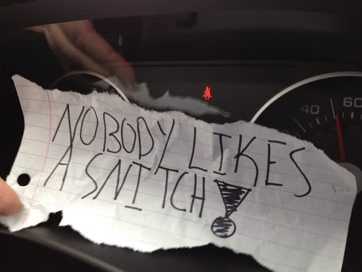

> [!CAUTION]
> The only official place to download snitch.out is this GitHub repository.
> Any other websites offering downloads or claiming to be us are not controlled
> by us, do not download from them.

![][badge-license]
![][badge-actions]
![][badge-downloads]
[![][badge-latest]][repo-latest]
![][badge-stars]

snitch.out is a custom bootstrapper for Roblox: version snapshot testing, custom
launcher themes, mods, FastFlags, and Discord Rich Presence.

It is a fork of [Fishstrap](https://github.com/fishstrap/fishstrap) (itself a
fork of [Bloxstrap][bloxstrap]), rebranded and extended with pinned cached
builds for comparing Roblox versions.

## Install

Download `snitch.out-Setup-*.exe` from the [latest release](https://github.com/7yass/snitch.out/releases/latest) and run it. The setup wizard checks for the .NET 6 Desktop Runtime, installs the app to `%LOCALAPPDATA%\snitch.out`, and creates your shortcuts.

If you found any bugs, please [open an issue here][repo-new-issue].

> [!NOTE]
> snitch.out is an application for **Windows 10 and above.** For other operating
> systems, such as Mac OS and various Linux distributions, you can try
> [AppleBlox][appleblox] and [Sober][sober] respectively.

## Features

- Detailed server information using [RoValra][rovalra]'s API
- Support for Roblox Studio
- Unhidden FastFlags editor
  - You cannot apply FastFlags not present in the allowlist. This does not
    affect Roblox Studio. [Learn more][devforum-fflags]
- Global Basic Settings editor
  - Ability to increase frame rate cap, toggle quality levels and more
- Version snapshots: pin cached builds to compare versions (Studio / local testing)
- Cache cleaner, channel switcher and many more

## Special thanks

- [Valra](https://github.com/NotValra) for providing their API
- Other independent contributors

[badge-license]:   https://img.shields.io/github/license/7yass/snitch.out?style=flat-square
[badge-actions]:   https://img.shields.io/github/actions/workflow/status/7yass/snitch.out/ci-release.yml?branch=main&style=flat-square&label=builds
[badge-downloads]: https://img.shields.io/github/downloads/7yass/snitch.out/latest/total?style=flat-square&color=981bfe
[badge-latest]:    https://img.shields.io/github/v/release/7yass/snitch.out?style=flat-square&color=7a39fb
[badge-stars]:     https://img.shields.io/github/stars/7yass/snitch.out?style=flat-square&color=dd9900

[repo-latest]:    https://github.com/7yass/snitch.out/releases/latest
[repo-new-issue]: https://github.com/7yass/snitch.out/issues/new/choose

[bloxstrap]: https://bloxstraplabs.com
[appleblox]: https://github.com/AppleBlox/appleblox
[sober]:     https://sober.vinegarhq.org
[rovalra]:   https://www.rovalra.com

[devforum-fflags]: https://devforum.roblox.com/t/allowlist-for-local-client-configuration-via-fast-flags/3966569
